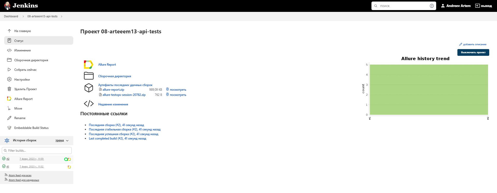
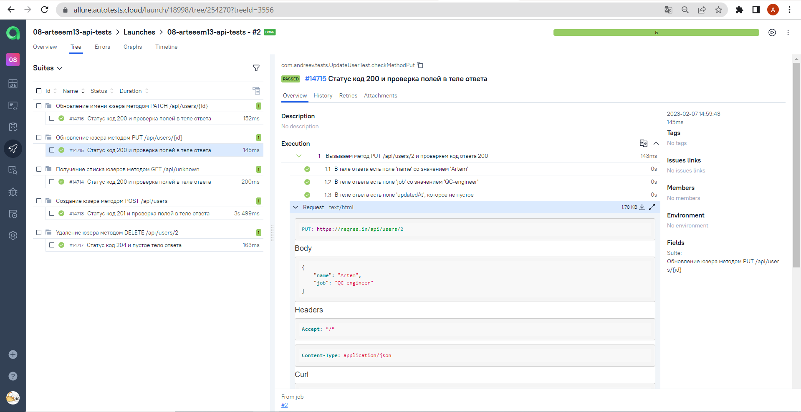

## ***In this project done:***
#### :heavy_check_mark: api-tests on methods reqres.in
#### :heavy_check_mark: pojo-classes for request and response bodies
#### :heavy_check_mark: steps
#### :heavy_check_mark: attachments for requests and responses
#### :heavy_check_mark: allure-reports
#### :heavy_check_mark: visualizing attachments in reports on special sample
###

###
#### :heavy_check_mark: automatic runner over jenkins
#### :heavy_check_mark: integration with Allure TestOps
###

###

